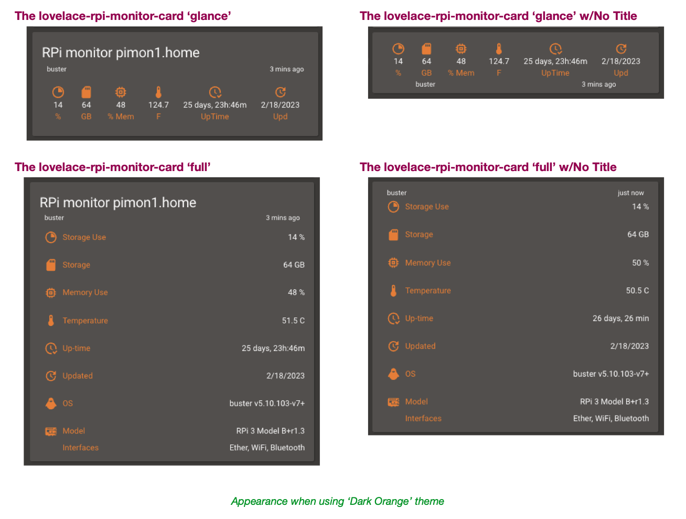
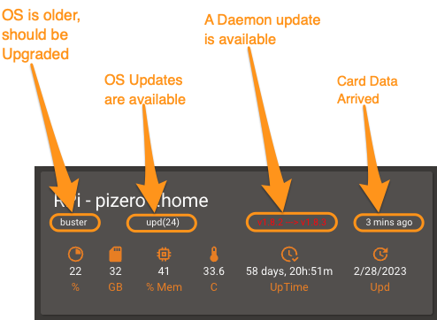
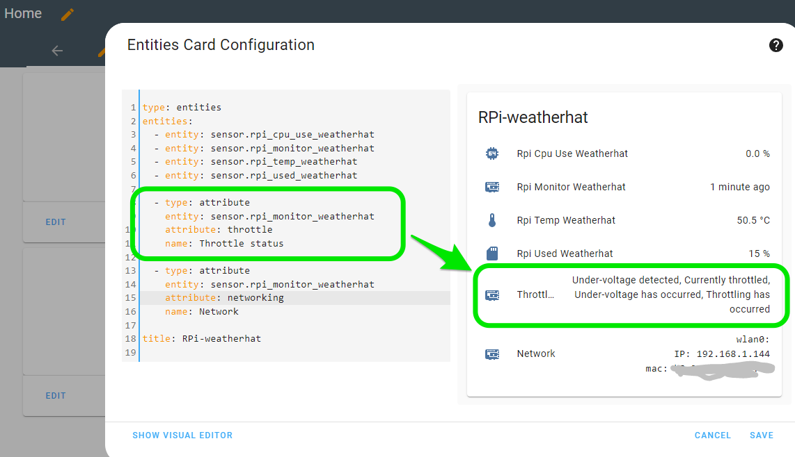
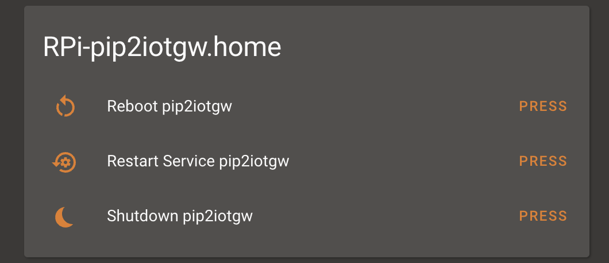

# Lovelace RPi Monitor Card

![Project Maintenance][maintenance-shield]

[![hacs_badge][hacs-shield]](https://github.com/custom-components/hacs)

[![License][license-shield]](LICENSE)

[![GitHub Release][releases-shield]][releases]


If you have a number of Raspberry Pis on your network then this might be the card you need to setup your Dashboard for monitoring all of you RPi's. Setup the sensor software on your RPi: See [RPi Reporter MQTT2HA Daemon](https://github.com/ironsheep/RPi-Reporter-MQTT2HA-Daemon). Then install this card to display the state of your RPi.

## About this card

This is a Lovelace card showing you the status of one of the Raspberry Pi's on your network. This card offers a choice of smaller 'glance' style card or the larger 'full' card. You choose which you'd like for each of your RPi's.



Place one of these cards for each of your RPi's on your network (and install the sensor/daemon script on each RPi) and you can monitor your entire constellation of RPi's "at a glance"!

### RPi Health Indicators

All of the card forms (as seen above) now have a row of RPi health indicators. With these indicators you can tell:

- If the RPi OS has reached [end of support](https://en.wikipedia.org/wiki/Debian_version_history) (no longer getting security updates) so it probably should be updated
- OS package updates are available
- If a new version of the RPi reporter Daemon is avaialble for install
- When the data shown on the card was last updated

<p align="center">
  
</p>

---

> If you like my work and/or this has helped you in some way then feel free to help me out for a couple of :coffee:'s or :pizza: slices!  Or you can support my work via Patreon!
>
> [](https://www.buymeacoffee.com/ironsheep) &nbsp;&nbsp; -OR- &nbsp;&nbsp; [](https://www.patreon.com/IronSheep?fan_landing=true)[Patreon.com/IronSheep](https://www.patreon.com/IronSheep?fan_landing=true)

---

## Installation

Use [HACS](https://github.com/custom-components/hacs) (recommended)
or download _rpi-monitor-card.js_ from our [Latest Release](https://github.com/ironsheep/lovelace-rpi-monitor-card/releases/latest) and place it in your www directory.

In your ui-lovelace.yaml (or resources.yaml, whichever you use for resources) add this:

```yaml
- url: /hacsfiles/lovelace-rpi-monitor-card/rpi-monitor-card.js
  type: module
```

If you don't use HACS please change the url accordingly.

To add RPi Monitor Card to your dashboard, click `ADD CARD` and search for `RPi Monitor Card`. Next you need to click `SHOW CODE EDITOR` to set at least the following entries:

```
type: custom:rpi-monitor-card
entity: sensor.your-raspberry-pi-monitor
```

**NOTE**: the entity must point to `sensor.rpi*monitor*{hostname}` sensor, **the other sensors from the same RPi will not work to drive this card!**

See more configuration options and examples below.


## Configuration

Configuration options for RPi Monitor Card. Those options also allow you to override some of the built-in coloring or display of titles/values, severities etc. 

| Name              | Type    | Default            | Description                                                                           |
| ----------------- | ------- | ------------------ | ------------------------------------------------------------------------------------- |
| type              | string  | **Required**       | `custom:rpi-monitor-card`                                                             |
| entity            | string  | **Required**       | Entity State                                                                          |
| name              | string  | none               | Overrides default title of the card. (Default: RPi Monitor {FQDN})                    |
| name_prefix       | string  | 'RPi monitor'      | Overrides default name prefix(Default: 'RPi Monitor')                                 |
| card_style        | string  | 'glance' or 'full' | Card layout desired for this RPi. (Default is full)                                   |
| temp_scale        | string  | 'C' or 'F'         | Show Temperature in Celsius (C) or Fahrenheit (F). (Default is C)                     |
| fs_severity       | object  | none               | A list of severity values. See [Severity Coloring](#severity-coloring).               |
| temp_severity     | object  | none               | A list of severity values. See [Severity Coloring](#severity-coloring).               |
| memory_severity   | object  | none               | A list of severity values. See [Severity Coloring](#severity-coloring).               |
| os_age            | object  | none               | A list of os name and color values. See [OS Coloring](#os-coloring).                  |
| os\_update_severity | object | none              | A list of update count values. See [Severity Options](#severity-options). |
| show_title        | boolean | true               | Show / hide the Title for this card. (Default is show - 'true')                       |
| show\_os_age       | boolean | true               | Show / hide the os release name (Default is show - 'true')                            |
| show\_update_age   | boolean | true               | Show / hide time since last values reported for this card. (Default is show - 'true') |
| show\_daemon_upd   | boolean | true               | Show / hide Daemon update needed flag. (Default is show - 'true')                     |
| show\_os\_upd_count | boolean | true               | Show / hide count of os updates pending. (Default is show - 'true')                   |

### Threshold Monitoring

The `system temperature`, `disk space used` and `memory used` values & icons are colored by threshold. The following defaults can be overridden for each card (each RPi.)

The default coloring is

| **Value**/color    | from | to  |
| ------------------ | ---- | --- |
| **Storage Used** % |      |     |
| default            | 0    | 60  |
| orange             | 61   | 85  |
| red                | 86   | 100 |
| **Temperature** C  |      |     |
| default            | 0    | 59  |
| orange             | 60   | 79  |
| red                | 80   | 100 |
| **Memory Used %**  |      |     |
| default            | 0    | 60  |
| orange             | 61   | 74  |
| red                | 75   | 100 |

The OS release name is also colored by expiration of support. The following defaults can be overridden for each card (each RPi.) with `red` meaning the named released is no longer supported / is not getting updates any longer.

The default release coloring is

| **Value**/color | Release | Exp. Date    |
| --------------- | ------- | ------------ |
| **OS Release**  |
| red             | wheezy  | 31 May 2018  |
| red             | jessie  | 30 June 2020 |
| red             | stretch | 30 June 2022 |

**NOTE:** The release colors are based on when the named released reaches [end of support](https://en.wikipedia.org/wiki/Debian_version_history) When a release reaches end of support we no longer get security updates. It is best to simply move to the current release (or last release supporting your RPi version) when this happens. These color flags on the OS release let us know when we should be thinking about building a new OS image for the affected RPi.

### RPi Daemon update available coloring

The Daemon update needed flag is colored according to version being run vs. the latest release. If the version being run is one back from the latest, the update is colored yellow. If current version is not in the list of most recent versions then it update is colored red. There is currently no override for this coloring.

### Count of Pending OS Updates coloring

The number of pending OS updates value is colored by threshold. The following defaults can be overridden for each card (each RPi.)

The default coloring is

| **Value**/color         | from | to    |
| ----------------------- | ---- | ----- |
| **Nbr Updates Pending** |      |       |
| default                 | 0    | 24    |
| orange                  | 25   | 99    |
| red                     | 100  | 10000 |

### Severity Coloring

| Name  | Type   | Default      | Description                                             |
| ----- | ------ | ------------ | ------------------------------------------------------- |
| from  | number | **Required** | Defines from which value the color should be displayed. |
| to    | number | **Required** | Defines to which value the color should be displayed.   |
| color | string | **Required** | Defines the color to be displayed.                      |

### OS Coloring

| Name  | Type   | Default      | Description                                                                         |
| ----- | ------ | ------------ | ----------------------------------------------------------------------------------- |
| os    | string | **Required** | Defines for which named release this color is displayed (e.g., 'buster', 'stretch') |
| color | string | **Required** | Defines the color to be displayed.                                                  |

### Example card specifications

**NOTE**: this card must always be attached to the `sensor.rpi*monitor*{hostname}` sensor, **the other sensors from the same RPi will not work to drive this card!**

A 'glance' card example

```yaml
type: 'custom:rpi-monitor-card'
entity: sensor.rpi_monitor_hostname
card_style: glance
temp_scale: f
```

A 'full' card example (_with additional coloring override example_)

```yaml
type: 'custom:rpi-monitor-card'
entity: sensor.rpi_monitor_hostname
card_style: full
temp_scale: C
fs_severity:
  - color: Green
    from: 0
    to: 25
  - color: Orange
    from: 26
    to: 50
  - color: Red
    from: 51
    to: 100
```

### Example monitoring of specific attributes

While we have the **Glance** and **Full** layout cards, you may wish to monitor other values. Here's an example of monitoring the RPi CPU Throttling that can occur or viewing the active network interfaces. Add the sensor(s) as follows:

```yaml
 - type: attribute
    entity: sensor.rpi_monitor_hostname
    attribute: throttle
    name: Throttle status
```

or...

```yaml
 - type: attribute
    entity: sensor.rpi_monitor_hostname
    attribute: networking
    name: Network
```

This shows the sensor add and the resultant output:



(_Thanks to gihub user @bsimmo for provinding this example._)

### Example control of your RPi (avail. in Daemon v1.8.0 and later)

From v1.8.0 and later of the RPi Reporter MQTT2HA Daemon we can enable control over our RPi.
We can then expose buttons offering this control with something like:

```yaml
- type: entities
  entities:
    - entity: button.rpi_command_pip2iotgw_reboot
      name: Reboot pip2iotgw
    - entity: button.rpi_command_pip2iotgw_restart_service
      name: Restart Service pip2iotgw
    - entity: button.rpi_command_pip2iotgw_shutdown
      name: Shutdown pip2iotgw
  title: RPi-pip2iotgw.home
```

This presents an interface like:

<p align="center">
  
</p>

## Credits

- Ian [iantrich](https://github.com/iantrich) for the card template and cards you've created which made my implementation effort much easier.
- Lucas [Gluwc](https://github.com/Gluwc) for the custom-card: bar-card for his example of how to handle users specifying coloring overrides.

## License

Licensed under the MIT License.

Follow these links for more information:

### [Copyright](copyright) | [License](LICENSE)

[maintenance-shield]: https://img.shields.io/badge/maintainer-stephen%40ironsheep.biz-blue.svg?style=for-the-badge

[hacs-shield]: https://img.shields.io/badge/HACS-Default-orange.svg?style=for-the-badge

[license-shield]: https://img.shields.io/badge/License-MIT-yellow.svg

[releases-shield]: https://img.shields.io/github/release/ironsheep/lovelace-rpi-monitor-card.svg?style=for-the-badge

[releases]: https://github.com/ironsheep/lovelace-rpi-monitor-card/releases
